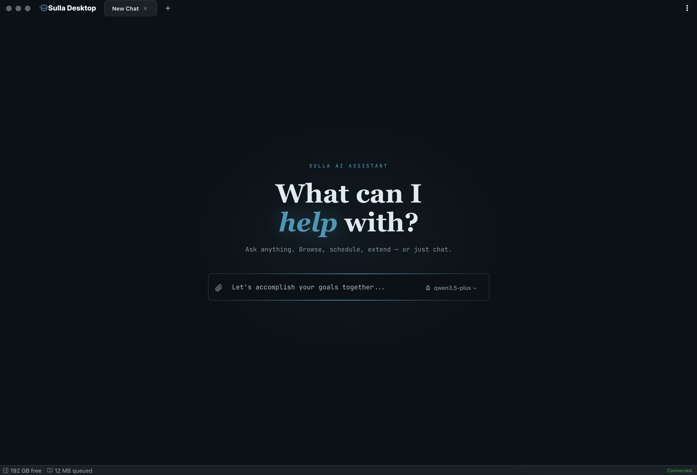

<div align="center">
  
  <p><strong>Your private AI executive assistant that runs on your machine.</strong></p>
  <p>Free to use, desktop-native autonomous agent with persistent memory, calendar engine, Docker workspaces, and automation — all yours to own and extend.</p>
  <p>
    <a href="https://github.com/merchantprotocol/sulla-desktop/releases/latest">
      
    </a>
    <a href="LICENSE">
      
    </a>
    <a href="https://github.com/merchantprotocol/sulla-desktop/stargazers">
      
    </a>
  </p>
</div>

> [!TIP]
> Install with a single command:
> ```
> curl -fsSL https://sulladesktop.com/install.sh | sh
> ```

<div align="center">
  
</div>

---

Designed for automation enthusiasts, vibe coders, business owners, agency owners, and operators who want more output without more hours or headcount. No subscriptions. No cloud lock-in. **Runs 100% locally** with llama.cpp and open-source models — or connect any remote API. Your choice.

## The Subconscious Agent System

### Just-in-Time Thinking

Traditional AI assistants dump everything into one massive system prompt and hope for the best. Sulla works differently — it thinks the way you do.

While the primary agent handles your conversation, a parallel layer of **subconscious agents** runs quietly in the background, each handling a specific cognitive task. The most important is **memory recall**: like human memory, it scans the current context each turn and pulls in relevant facts, skills, and documents from long-term storage — just in time, not all at once.

This means the agent starts lean. Instead of a bloated prompt trying to explain everything upfront, Sulla teaches the agent to be **resourceful** — to locate the information it needs, when it needs it.

```
┌─────────────────────────────────────────────────┐
│                  YOUR CONVERSATION              │
│                                                 │
│  You: "Schedule a deploy for Friday and         │
│        notify the team on Slack"                │
│                                                 │
│  ┌─────────────┐                                │
│  │ Primary     │  Handles your request          │
│  │ Agent       │  directly                      │
│  └──────┬──────┘                                │
│         │                                       │
│ ── ── ──│── ── ── ── ── ── ── ── ── ── ── ── ──│
│  SUBCONSCIOUS LAYER (parallel, every turn)      │
│         │                                       │
│         ├──► Memory Recall                      │
│         │    Loads: deploy runbook, Slack        │
│         │    channel IDs, team preferences      │
│         │                                       │
│         ├──► Short-Term Memory Distillation      │
│         │    Summarizes old messages, prunes     │
│         │    irrelevant turns, frees context     │
│         │                                       │
│         └──► Observational Memory               │
│              Extracts facts, updates identity    │
│              files, removes stale observations   │
│                                                 │
│  ┌─────────────┐                                │
│  │ Primary     │  Now has everything it needs    │
│  │ Agent       │  without being told upfront     │
│  └─────────────┘                                │
└─────────────────────────────────────────────────┘
```

The result: a lightweight agent that **gets smarter with every turn** instead of a heavy one that starts slow and forgets fast.

### Observational Memory

Every conversation is full of important details — preferences, decisions, project context, deadlines — that vanish the moment a chat ends. Sulla doesn't let that happen.

A dedicated **observation agent** monitors every conversation in the background, watching for facts worth keeping. It scores them by importance, writes the high-value ones to a global memory store, and quietly removes observations that have gone stale. The next time you open a chat — any chat, with any agent — those facts are already there.

This is why Sulla never feels like a blank slate. Every conversation picks up where the last one left off, even across different agents and topics.

The observation agent also distills long-running patterns into **identity files** — persistent documents that capture who you are, how you work, and what matters to you. These aren't chat logs; they're living summaries that stay current as your observations accumulate. Important context is never buried in a scroll-back — it's promoted into your identity so every agent starts with a real understanding of you.

```
┌─────────────────────────────────────────────────┐
│              CONVERSATION IN PROGRESS            │
│                                                  │
│  You: "Use the staging cluster, not prod —       │
│        we burned a deploy last week"             │
│                                                  │
│ ── ── ── ── ── ── ── ── ── ── ── ── ── ── ── ──│
│  OBSERVATION AGENT (background, continuous)       │
│                                                  │
│  1. Detect   "staging not prod" = high-value     │
│              "burned a deploy"  = context/why     │
│                                                  │
│  2. Store    ┌──────────────────────────────┐    │
│              │ Global Memory                │    │
│              │                              │    │
│              │ + "Deploy to staging only     │    │
│              │    — prod deploy incident     │    │
│              │    last week"          [new]  │    │
│              │                              │    │
│              │ - "API key rotates monthly"   │    │
│              │              [stale, removed] │    │
│              └──────────────────────────────┘    │
│                                                  │
│  3. Promote  ┌──────────────────────────────┐    │
│              │ Identity Files               │    │
│              │                              │    │
│              │ preferences.md               │    │
│              │   "Prefers staging-first      │    │
│              │    deploys, risk-averse       │    │
│              │    after recent incident"     │    │
│              └──────────────────────────────┘    │
│                                                  │
│ ── ── ── ── ── ── ── ── ── ── ── ── ── ── ── ──│
│  NEXT CONVERSATION (any agent, any topic)        │
│                                                  │
│  Agent already knows: use staging, not prod      │
│  No one had to say it again.                     │
└─────────────────────────────────────────────────┘
```

### Context Window Management

LLMs have a fixed context window. Most agents ignore this until they hit the wall — then the conversation dies or the model starts hallucinating. Sulla manages it proactively.

A **short-term memory agent** watches your message thread as it grows. Older messages accumulate a **staleness score** — the further back they are and the less relevant they are to the current task, the higher they score. When the thread gets heavy, the agent acts:

- **Irrelevant messages** are pruned entirely
- **Aging messages with useful facts** are summarized and distilled down to just the key information
- **Recent and active messages** are left untouched

The effect is a context window that **breathes**. Instead of filling up and crashing, it stays lean — always leaving room for the agent to focus on what you're working on right now, while retaining every fact that still matters.

You never hit the wall. You never lose a conversation mid-task. The chat just keeps going.

```
┌─────────────────────────────────────────────────┐
│  CONTEXT WINDOW                                  │
│                                                  │
│  Without management:                             │
│  ┌───────────────────────────────────────────┐   │
│  │██████████████████████████████████████████ │   │
│  │ msg msg msg msg msg msg msg msg msg msg   │   │
│  │ msg msg msg msg msg msg msg msg msg msg   │   │
│  │ msg msg msg msg msg msg ████ LIMIT HIT ██ │   │
│  └───────────────────────────────────────────┘   │
│  Agent chokes. Conversation dies.                │
│                                                  │
│                                                  │
│  With short-term memory agent:                   │
│  ┌───────────────────────────────────────────┐   │
│  │                                           │   │
│  │  [summary: project setup, deploy target]  │   │
│  │  [summary: auth flow decided, JWT + vault]│   │
│  │  ·  ·  ·  pruned  ·  ·  ·                │   │
│  │  msg msg msg msg msg msg                  │   │
│  │  msg msg ← current task                   │   │
│  │                     ▓▓▓▓▓ FREE SPACE ▓▓▓▓ │   │
│  └───────────────────────────────────────────┘   │
│  Agent stays fast. Conversation keeps going.     │
│                                                  │
│                                                  │
│  How staleness scoring works:                    │
│                                                  │
│  Turn 1  ████████████░  high staleness → prune   │
│  Turn 5  ██████░░░░░░░  moderate → summarize     │
│  Turn 12 ██░░░░░░░░░░░  low → summarize          │
│  Turn 30 ░░░░░░░░░░░░░  current → keep as-is     │
│                                                  │
└─────────────────────────────────────────────────┘
```

## Sandboxed Environment

Sulla runs natively on your desktop — macOS, Windows, and Linux — with a one-command install. But under the hood, the agent doesn't run on your host machine. It runs inside a **containerized virtual machine**.

Your user directory is mounted into the sandbox so the agent can work with your files, but it cannot reach outside that boundary. It can't modify system files, install packages on your host, or accidentally break your OS. The attack surface is dramatically smaller than any agent running directly on your machine.

Docker runs inside the container alongside the agent, giving it the ability to spin up and manage containers for your projects. An **extensions library** provides one-click recipes for common services — CRMs, media editing tools, local AI models — that the agent can deploy and control to tackle your tasks. It can also run its own models for speech-to-text, vision, text-to-speech, and more, all swappable, giving both you and your agent flexibility for vibe-coding and beyond.

```
┌─────────────────────────────────────────────────┐
│  YOUR MACHINE (host)                             │
│                                                  │
│  ┌────────────────────────────────────────────┐  │
│  │  SANDBOXED VM                              │  │
│  │                                            │  │
│  │  ┌──────────┐  ┌──────────┐  ┌──────────┐ │  │
│  │  │ Sulla    │  │ Docker   │  │ Extensions│ │  │
│  │  │ Agent    │  │ Engine   │  │ Library   │ │  │
│  │  └──────────┘  └──────────┘  └──────────┘ │  │
│  │                                            │  │
│  │  ┌──────────────────────────────────────┐  │  │
│  │  │  ~/your-files (mounted, read/write)  │  │  │
│  │  └──────────────────────────────────────┘  │  │
│  │                                            │  │
│  │  ✗ No access to system files               │  │
│  │  ✗ No access to other user accounts        │  │
│  │  ✗ No host-level package installation      │  │
│  └────────────────────────────────────────────┘  │
└─────────────────────────────────────────────────┘
```

## Security

### Encrypted Password Vault

Sulla includes a built-in **password manager** with AES-256 encryption at rest. When the vault is locked, nobody — not even the agent — can access your credentials. They are only decrypted in memory when you need them.

The vault also watches the browser. When it detects a login form, it offers to save those credentials automatically. From there, you control exactly how much access the agent gets:

- **Full access** — the agent can read and use credentials directly
- **Autofill only** — credentials are injected *after* the agent makes a request, so the agent never handles your secrets directly. They never appear in logs, conversation history, or tool call outputs

This means your API keys, passwords, and tokens stay on your machine, encrypted, and out of the agent's context.

### System Lock

Sulla locks when you log out. Your personal assistant, vault, and all stored credentials are inaccessible until you authenticate again.

## Chromium Browser

Sulla ships with a **full Chromium browser** built in — not a webview wrapper, a real browser instance. Most browser agents are limited to a fixed set of commands: click here, type there, scroll down. Sulla isn't restricted like that.

The agent can **execute arbitrary JavaScript** directly inside any webpage. It can take a screenshot to see what's on screen, send real mouse clicks and keystrokes, *and* inject its own scripts to read, modify, or automate anything on the page. There's no predefined command list boxing it in — if you can do it in a browser console, the agent can do it too.

- **Unrestricted JavaScript execution** — run any script directly in the page, not just predefined actions
- **Screenshots and visual understanding** — the agent sees what you see and reasons about it
- **Trusted keyboard and mouse events** — websites accept them as real user input, not synthetic automation
- **Page visibility** — full DOM access, text extraction, and image recognition on any page
- **Browse history awareness** — context about where you've been, accessible to the agent
- **Login with saved credentials** — combined with the vault, the agent can authenticate on your behalf

This gives you a fully **agentic browser experience** with no guardrails on capability. Point it at your social media, your admin dashboards, your SaaS tools — the agent can navigate, fill forms, click buttons, run custom scripts, and execute multi-step workflows across any website, moving as freely as you would.

```
┌─────────────────────────────────────────────────┐
│  SULLA BROWSER (Chromium)                        │
│  ┌───────────┬───────────┬───────────┐          │
│  │ Tab 1     │ Tab 2     │ Tab 3     │          │
│  └───────────┴───────────┴───────────┘          │
│  ┌───────────────────────────────────────────┐  │
│  │                                           │  │
│  │         Website loaded                    │  │
│  │                                           │  │
│  │  Agent can:                               │  │
│  │   → Read page content (DOM, text, images) │  │
│  │   → Execute JavaScript                    │  │
│  │   → Click, type, scroll (trusted events)  │  │
│  │   → Fill forms with vault credentials     │  │
│  │   → Navigate across pages and tabs        │  │
│  │                                           │  │
│  └───────────────────────────────────────────┘  │
│  ┌──────────────────┐                           │
│  │ Side Panel Chat  │  AI actions in context    │
│  └──────────────────┘                           │
└─────────────────────────────────────────────────┘
```

## Workbench

Sulla has two modes. **Easy mode** is the chat and browser — conversational, visual, point-and-click. But behind it is a full **workbench** for when you want to go deeper.

The workbench gives you direct access to everything the agent creates and stores — files, conversations, logs, configurations — all in standard file formats you can open, edit, and version control. It includes:

- **File explorer** with Monaco code editor and inline diff viewer
- **Git management** — your entire agent is under version control, so you can track every change, roll back, and branch
- **Agent builder** — create specialized agents with custom system prompts, specific skill sets, and curated tool access, then deploy them for handling complex domain-specific tasks
- **Integrated terminal** for direct shell access into the sandboxed environment

```
┌─────────────────────────────────────────────────┐
│  WORKBENCH                                       │
│  ┌──────────┬────────────────────────┬────────┐ │
│  │ Files    │ Monaco Editor          │ Agent  │ │
│  │          │                        │ Config │ │
│  │ agents/  │  system-prompt.md      │        │ │
│  │ skills/  │  ───────────────       │ Name   │ │
│  │ tools/   │  You are a social      │ Skills │ │
│  │ logs/    │  media manager...      │ Tools  │ │
│  │ convos/  │                        │ Model  │ │
│  │          │                        │        │ │
│  ├──────────┴────────────────────────┤ Deploy │ │
│  │ Terminal    $ git log --oneline   │        │ │
│  └───────────────────────────────────┴────────┘ │
└─────────────────────────────────────────────────┘
```

## Agentic Workflows

Most workflow tools make you wire up API calls and configure every node by hand. Sulla's workflows are different — they're **agentic**.

Drag nodes onto a canvas. Write a plain-language prompt on each one describing what you want that step to do. That's it. No configuration, no field mapping, no API plumbing. An **orchestrating agent** walks through every node in your workflow, reads your prompt, makes decisions, and executes — calling tools, spawning sub-agents, and moving to the next step autonomously.

This is how you encode **Standard Operating Procedures** into your agent. The orchestrator is forced to follow every step in order — it can't skip ahead, it can't shortcut to the end, it has to walk through your exact process. For long-running, multi-step operations where precision matters, this is how you guarantee the agent does it your way, every time.

And you don't have to build them yourself. Sulla creates its own workflows when it identifies repeatable processes — but you always have the ability to go in, edit, reorder, and lock down the steps.

This is how Sulla's **daily training system** works. Every day, at the same time, a scheduled workflow launches:

1. Multiple agents fan out to review your conversations, logs, and documents
2. They analyze your stated goals and track progress against them
3. They update Sulla's own **goal alignment** — creating internal goals derived from yours
4. Every future conversation is informed by this alignment, so the agent's decisions actively push toward your objectives instead of making generic choices

The result: an agent that **gets more aligned with you every day**, automatically, without you having to repeat yourself.

```
┌─────────────────────────────────────────────────┐
│  WORKFLOW CANVAS                                 │
│                                                  │
│  ┌──────────┐    ┌──────────┐    ┌──────────┐  │
│  │ Trigger  │───►│ Review   │───►│ Extract  │  │
│  │ Daily 6am│    │ all convos│    │ goals    │  │
│  └──────────┘    └──────────┘    └─────┬────┘  │
│                                        │        │
│                                   ┌────▼────┐   │
│                                   │ Compare │   │
│                                   │ to user │   │
│                                   │ goals   │   │
│                                   └────┬────┘   │
│                        ┌───────────────┤        │
│                   ┌────▼────┐    ┌────▼─────┐  │
│                   │ Update  │    │ Generate  │  │
│                   │ agent   │    │ daily     │  │
│                   │ goals   │    │ report    │  │
│                   └─────────┘    └──────────┘  │
│                                                  │
│  Each node = a prompt. The orchestrator decides  │
│  how to execute it. No config. No wiring.        │
└─────────────────────────────────────────────────┘
```

## Always-On Heartbeat & Calendar

Sulla isn't a tool you open, use, and close. It has a **persistent heartbeat** running in the background that gives it an always-on, always-alive presence on your machine.

The agent manages its own **calendar** — it can create events, set reminders, and schedule jobs autonomously. Tell it to remind you at 3pm and it will. Tell it to check a deploy status every hour and it will. The calendar isn't just a display — it's an execution engine that triggers the agent to act at the right time.

If your computer goes to sleep, the heartbeat and event system **wake it back up**. Sulla prevents sleep from killing long-running tasks or missed events. Your scheduled agents, training jobs, and reminders keep firing whether you're at the keyboard or not.

```
┌─────────────────────────────────────────────────┐
│  HEARTBEAT (persistent, background)              │
│                                                  │
│  ♥ alive ──── ♥ alive ──── ♥ alive ──── ♥       │
│                                                  │
│  CALENDAR                                        │
│  ┌───────────────────────────────────────────┐   │
│  │ 06:00  Daily training workflow      [auto]│   │
│  │ 09:00  Check deploy status          [auto]│   │
│  │ 11:30  "Remind me to review PR #340" [you]│   │
│  │ 15:00  Goal alignment check         [auto]│   │
│  │ 22:00  Nightly model fine-tune      [auto]│   │
│  └───────────────────────────────────────────┘   │
│                                                  │
│  Computer sleeps → heartbeat wakes it → agent    │
│  runs the 06:00 training job on time             │
└─────────────────────────────────────────────────┘
```

## Self-Improving Training System

Sulla doesn't just use models — it **trains them**.

Every night, a scheduled workflow collects the day's conversations, your documents, and interaction logs, then fine-tunes your local model on that data. The agent literally becomes more like you over time — learning your writing style, your preferences, your decision patterns — through actual model training, not just prompt context.

This runs entirely on your machine with **100% local models** via llama.cpp. No data leaves your computer. No third-party training APIs. The model that runs tomorrow is better than the one that ran today, and it's yours.

You can also trigger training manually, review training logs, and manage training datasets from the workbench.

```
┌─────────────────────────────────────────────────┐
│  NIGHTLY TRAINING CYCLE                          │
│                                                  │
│  ┌──────────┐   ┌──────────┐   ┌──────────┐    │
│  │ Collect  │──►│ Build    │──►│ Fine-tune│    │
│  │ convos,  │   │ training │   │ local    │    │
│  │ docs,    │   │ dataset  │   │ model    │    │
│  │ logs     │   │ (JSONL)  │   │ (llama.cpp) │    │
│  └──────────┘   └──────────┘   └─────┬────┘    │
│                                       │         │
│                                  ┌────▼─────┐   │
│                                  │ Tomorrow │   │
│                                  │ the agent│   │
│                                  │ is better│   │
│                                  └──────────┘   │
│                                                  │
│  Day 1:  Generic model                           │
│  Day 7:  Knows your writing style                │
│  Day 30: Anticipates your decisions              │
│  Day 90: Thinks like you                         │
└─────────────────────────────────────────────────┘
```

## Core Specs

- Chrome-like browser with WebContentsView tabs, side panel chat, and AI context menus
- Encrypted password vault with autofill, import/export, and Bitwarden-style generator
- Node-graph workflow editor with parallel execution, loops, and checkpoints
- Multi-agent system with per-agent integrations, orchestrator escalation, and conversation history
- Sulla CLI with daemon relay and integration tooling
- Integrated terminal, Monaco code editor, and Git pane
- Login/logout system with vault auto-unlock and menu locking
- Training system — capture conversations and fine-tune models
- Calendar engine with auto-wake events
- Docker workspaces with container management and shell access
- Live monitoring dashboard with per-endpoint graphs
- Multiple theme presets (default, nord, ocean, protocol) with dark/light modes
- Runs on consumer hardware (8–16 GB RAM recommended)
- Source-available (Apache 2.0 + Commons Clause) — fork, extend, own it

## Install

One command. Works on **macOS**, **Linux**, and **Windows** (Git Bash or WSL).

```bash
curl -fsSL https://sulladesktop.com/install.sh | sh
```

**What it does:**
1. Downloads the latest pre-built release from GitHub
2. Installs the app (DMG/ZIP on macOS, MSI on Windows, ZIP on Linux)
3. Handles macOS Gatekeeper automatically (no "damaged app" warnings)

No build tools required — just `curl`.

> **Developer?** Use `install-dev.sh` to build from source instead.

### Manual install

```bash
git clone https://github.com/merchantprotocol/sulla-desktop.git
cd sulla-desktop
yarn install
NODE_OPTIONS="--max-old-space-size=12288" yarn build
npx electron .
```

### After install

Step 1 — Connect any LLM (local llama.cpp or remote API)  
Step 2 — Start delegating

## Your No-Hassle Ownership Promise

100% source-available. No subscriptions. No usage caps. No data sharing.
Install it, run it, modify it — it’s yours.

## Frequently Asked Questions

**How much hardware do I need?**  
8 GB RAM minimum (runs well), 16 GB+ ideal for faster inference. Works on most modern laptops/desktops.

**How fast can I expect real results?**  
Workflow velocity and delegation confidence build in 7–30 days of consistent use. Results scale with your task volume.

**Is it fully local?**  
Core agent, memory, tools, and execution run 100% on your machine. LLM inference can be local (llama.cpp) or remote (your choice for speed/privacy balance).

**How do I extend it?**
Build custom workflow nodes, add tool integrations, or create new agent configurations. Everything is modular and documented.

**Who is this really for?**
Anyone who codes by vibe, runs automations, or has more high-leverage tasks than time — and wants to stop paying specialists to do what their own machine can handle.

Install Sulla Desktop today.  
You deserve an assistant that scales with you, not against you.

— Jonathon Byrdziak  
Coeur d’Alene, Idaho  
Founder, Sulla Desktop

## License

Forked from Rancher Desktop<a href="https://github.com/rancher-sandbox/rancher-desktop" target="_blank" rel="noopener noreferrer nofollow"></a>
Licensed under Apache 2.0 with the [Commons Clause](LICENSE) restriction. See [LICENSE](LICENSE) for details.

**In short:** You can use, modify, and fork Sulla Desktop freely — including for internal commercial use. You **cannot** rebrand, white-label, or resell it as your own product. See the [Trademark Policy](TRADEMARK.md) for branding requirements.

Original copyright: © Rancher Labs, Inc. and contributors.
