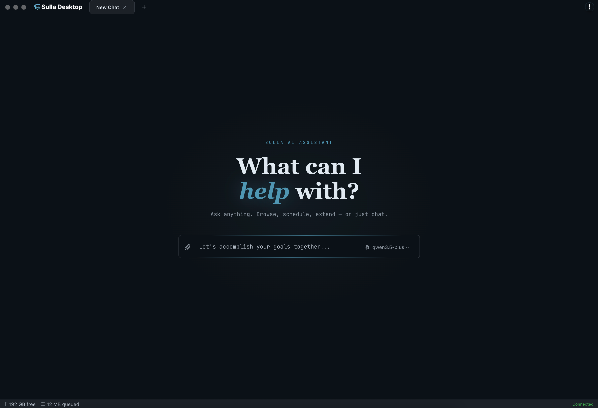

<div align="center">
  
  <h1>Set up an automation once. Never babysit it again.</h1>
  <p><strong>Sulla is an AI executive assistant that lives on your computer.</strong><br/>
  Tell it what you want done in plain English. It builds the automation, runs it on schedule,<br/>
  and keeps it working when your apps and websites change.</p>
  <p>
    <a href="https://github.com/merchantprotocol/sulla-desktop/releases/latest">
      
    </a>
    <a href="LICENSE">
      
    </a>
    <a href="https://github.com/merchantprotocol/sulla-desktop/stargazers">
      
    </a>
  </p>
  <p>
    <a href="https://sulladesktop.com"><strong>Website</strong></a> ·
    <a href="https://sulladesktop.com/downloads.html"><strong>Download</strong></a> ·
    <a href="https://docs.sulladesktop.com"><strong>Docs</strong></a> ·
    <a href="https://sulladesktop.com/support.html"><strong>Support</strong></a>
  </p>
</div>

> [!TIP]
> Install with one command on macOS, Linux or Windows (Git Bash / WSL):
> ```bash
> curl -fsSL https://sulladesktop.com/install.sh | sh
> ```
> Or grab an installer from the [latest release](https://github.com/merchantprotocol/sulla-desktop/releases/latest).

<div align="center">
  
</div>

---

## The problem Sulla solves

Almost everyone who finds Sulla starts with the same sentence: **"I want to set up automations."**

Most automation tools connect apps by mapping fields between them. That works until a form changes, a login expires, or a website moves a button. Then the automation breaks, usually silently, and you become its full-time maintainer. That's the **maintenance tax**.

Sulla removes it. You describe the job the way you'd explain it to a new assistant, and Sulla does the work:

| Traditional automation | Sulla |
|---|---|
| You map every field and API call by hand | You describe the outcome and Sulla builds the steps |
| Breaks when an app or page changes | Each step is an instruction, not a brittle field mapping |
| Fails silently | Pauses and asks you when it's genuinely stuck |
| Only works with apps that have an integration | 300+ integrations, plus a real browser for everything else |
| Starts over after a crash | Saves progress after every step and resumes where it stopped |

## How it works

1. **Describe the job.** Type or say it: *"Every Monday, chase anything unpaid for more than 14 days. Be polite. Anything over 30 days, send to me instead."*
2. **Sulla builds the workflow.** It turns your words into a visual workflow: a trigger, the steps, and the checkpoints where it asks you. You can read and edit every step, in plain English.
3. **It runs. You get the results.** It can run on a schedule, from a calendar event, from a chat message, or from a background check. Sulla does the work and only interrupts you when a decision is yours.

## What people hand to Sulla first

| Automation | Trigger | What Sulla does |
|---|---|---|
| **Lead follow-up** | A new lead comes in | Looks the lead up, drafts a reply in your voice, books the call, and waits for your OK before sending |
| **Invoice chasing** | Every Monday | Finds overdue invoices, sends polite reminders, and escalates the ones that need a call |
| **Morning briefing** | Weekdays at 7 AM | Calendar, important email, open tasks and overnight changes on one page |
| **Inbox triage** | Every hour | Sorts mail, drafts routine replies, and flags only what needs you |
| **Content from your notes** | Every Friday | Turns the week's notes into a blog post and social drafts for review |
| **Reports from any portal** | First of the month | Logs into sites with no export, pulls the numbers, and updates your spreadsheet |

Anything you ask Sulla to do twice is a candidate for an automation, and Sulla will suggest one.

## An executive assistant, not just a bot

- **Chat or talk to it.** Sulla handles one-off requests as well as recurring ones, and it remembers your preferences between conversations.
- **Works in a real browser.** A built-in Chromium browser lets Sulla log into your tools with your saved credentials, click, read and download on sites that have no API.
- **300+ integrations.** Gmail, Slack, HubSpot, QuickBooks, Stripe, Notion, Google Sheets and many more. Connect once, and every automation can use the connection.
- **Calendar and reminders.** "Remind me at 3" and "check this every hour" both just work. Sulla keeps your computer awake for scheduled work so jobs aren't missed.
- **Projects.** Longer goals are broken into tasks Sulla tracks and works through, and you can see them on a board.
- **Marketplace.** Install ready-made workflows, skills, agents and service recipes from the community library.

## You stay in charge

- **Approval steps.** Put an approval anywhere in a workflow. Sulla drafts, then waits for your OK before emailing, messaging or posting in your name.
- **Encrypted vault.** Credentials are encrypted with AES-256 at rest. For each credential you choose whether Sulla can read it or only autofill it, so the agent never sees the secret.
- **Sandboxed by design.** Sulla's agents work inside an isolated virtual machine with your user folder mounted, not directly on your operating system.
- **Your data stays home.** Memory, workflows, files and credentials live on your machine. If you use a hosted AI model, each request's text goes to that provider. Use a local model to keep everything offline.
- **Locks with you.** Log out and the assistant, vault and stored credentials stay locked until you sign back in.

## Get started

1. **Install Sulla.** Use the one-line installer above or download from [Releases](https://github.com/merchantprotocol/sulla-desktop/releases/latest). The installer handles macOS Gatekeeper for you.
2. **Choose your AI.** Paste a key from Anthropic, OpenAI or another provider, or run a free local model with llama.cpp.
3. **Describe your first job.** Pick a starter automation or write your own. Sulla sets it up and runs it once so you can see the result.

**Requirements:** macOS 11+, Windows 10+ or Ubuntu 20.04+. 8 GB RAM minimum, 16 GB recommended. The app is about 1.2 GB, plus space for its workspace.

### Build from source

```bash
git clone https://github.com/merchantprotocol/sulla-desktop.git
cd sulla-desktop
yarn install
NODE_OPTIONS="--max-old-space-size=12288" yarn build
npx electron .
```

Or run `install-dev.sh` to build and install from source in one step.

## Under the hood

For developers and tinkerers, this is what makes the automations durable:

- **Workflow engine.** Workflows are graphs of typed nodes: triggers (schedule, calendar, chat, heartbeat, desktop events, an OpenAI-compatible API), agent steps, tool and integration calls, routers and conditions, loops, parallel branches, waits, sub-workflows and user-input/approval steps. An orchestrating agent walks the graph in order and can't skip steps. The full run state is checkpointed to Postgres after every node, so runs survive restarts. Workflows are plain YAML files you can version-control.
- **Heartbeat.** A background agent keeps Sulla alive between conversations. It fires scheduled work, picks up project tasks, and checks on long-running jobs.
- **Subconscious agents.** Alongside the main conversation, background agents prepare just-in-time context (the right tools, facts and skills for this turn), remind the agent of your rules before it acts, distill long threads so the context window never fills up, and record durable observations about you and your work.
- **Memory.** Observational memory stores what matters (preferences, decisions, context) and prunes what's gone stale, so every new conversation starts informed.
- **Agents and skills.** Create specialized agents with their own prompts, skills and tool access. Sulla can spawn sub-agents for parallel work.
- **Sulla CLI.** Every tool (browser, GitHub, calendar, vault, Docker, Kubernetes, Slack, workflows, projects and more) is callable as `sulla <category>/<tool> '<json>'` from the sandbox.
- **Workbench.** File explorer, Monaco editor with diffs, Git management, an integrated terminal into the sandbox, and an agent builder.
- **Containers.** Docker runs inside the VM, so Sulla can start services for your projects and install one-click recipes (CRMs, media tools, local AI models) from the marketplace.
- **Models.** Use hosted providers or local open-source models via llama.cpp. Conversations are captured locally as training data for local models.

Forked from [Rancher Desktop](https://github.com/rancher-sandbox/rancher-desktop), which provides the VM and container foundation.

## FAQ

**Is Sulla free?**
Yes. The desktop app is free to download and use. Sulla needs an AI model to think with: run a free local model, or connect your own account with a provider like Anthropic or OpenAI and pay them directly for what you use. Most people get the best results from a hosted model.

**Do I need to code?**
No. Describe what you want and Sulla builds the workflow. Every workflow is also editable on a visual canvas and as a plain file if you want to go deeper.

**What happens when an automation gets stuck?**
Small changes to a page or app usually don't break it, because each step is an instruction Sulla carries out rather than a hard-coded mapping. When Sulla really can't continue, it pauses at that step and tells you what it needs. Progress is saved after every step, so it resumes where it stopped.

**Will it send things without asking me?**
Only if you let it. Add an approval step and Sulla waits for your OK before anything goes out in your name.

**How is this different from Zapier, Make or n8n?**
Those tools connect apps by mapping fields, and you maintain the mappings. Sulla is an assistant that does the work: it reads, decides, writes, and uses a real browser when there's no integration. You describe the outcome, not the plumbing. (Sulla can also drive n8n if you already use it.)

**Does my computer need to stay on?**
Sulla runs on your machine, so scheduled work runs while it's on. It prevents sleep during scheduled work so jobs aren't missed.

**Where can I get help?**
[GitHub Discussions](https://github.com/merchantprotocol/sulla-desktop/discussions) and [Issues](https://github.com/merchantprotocol/sulla-desktop/issues) for free community support, or see [Support](https://sulladesktop.com/support.html) for other options.

## License

Licensed under Apache 2.0 with the [Commons Clause](LICENSE) restriction. See [LICENSE](LICENSE) for details.

**In short:** You can use, modify and fork Sulla Desktop freely, including for internal commercial use. You **cannot** rebrand, white-label or resell it as your own product. See the [Trademark Policy](TRADEMARK.md) for branding requirements.

Original Rancher Desktop copyright: © Rancher Labs, Inc. and contributors.

— Jonathon Byrdziak, Coeur d'Alene, Idaho · Founder, Sulla Desktop
